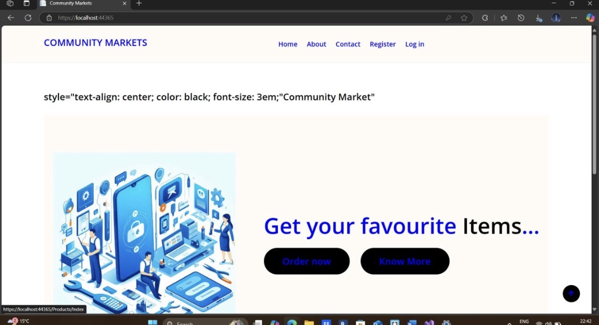
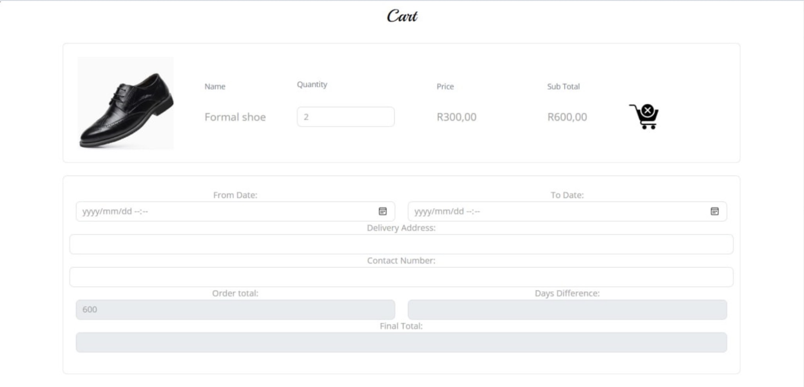
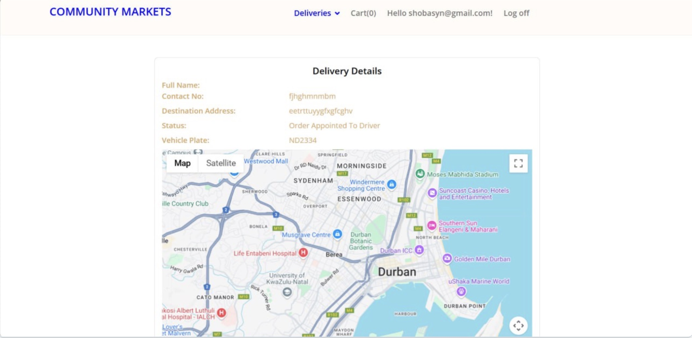

# Community Marketplace Web Application

A web-based marketplace platform designed to connect local community members with buyers and sellers.

## Project Overview
This system allows community members to list products and browse items from local vendors.

## Features
• User registration
• Marketplace browsing
• Product listings
• Responsive design
• Simple and clean UI

## Technologies Used
     - **Frontend:** HTML5, CSS3, Bootstrap 5, JavaScript (ES6+)
     - **Backend:** C# / ASP.NET Core
     - **Architecture:** MVC Pattern

## Installation
     1. Clone the repository: `git clone https://github.com/tngubane-ctrl/web-comm-markets.git`
     2. Open the project folder in Visual Studio
     3. Run `dotnet restore` in the terminal
     4. Run `dotnet run` to start the application
     5. Open your browser and go to `http://localhost:5000`

## Author
Thandokuhle Ngubane & Members

## Screenshots

### Homepage

### Register Page

## Login Page

## Marketplace

## Item Cart

## Payment Page

## Delivery Tracking

